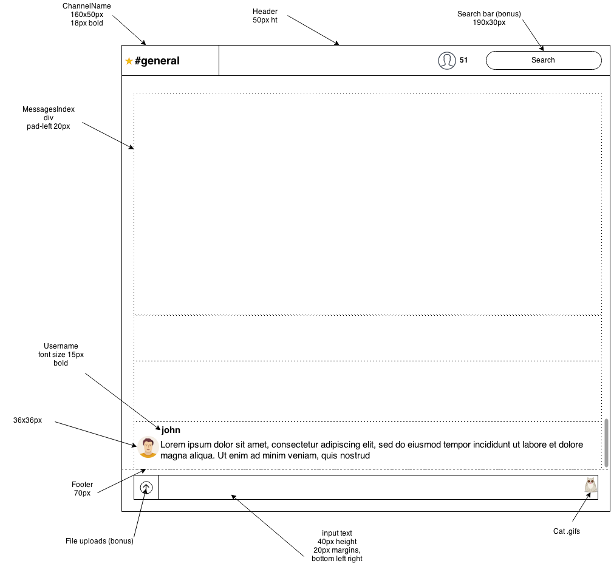

# Views
## Landing page

## Layout
- div id="container"
  - div class="nav-left"
  - div class="channel"
  - div class="nav-context" (right, bonus)

## Channel Feed
- div class="channel"
  - div class="nav-top"
  - div class="channel-area"
  - div class="scrollbar"
    - div class="message-area" (messageIndex at first, channelShow later)
      - div class="message"
        - div class="gravatar"
        - div class="username"
        - span class="timestamp"
        - div class="content"
  - footer (messageForm)
    - div class="file-upload btn"
    - input type="text"
    - div class="gat-gif-attacher"

## Side Nav - left (starts off static)
- div class="nav nav-left"
  - div class="group-tab"
    - div class="group-tag"
    - div class="group-label"
  - div class="group-header"
  - div class="starred nav-list"
  - div class="channels nav-list"
  - div class="messages nav-list"

 

## Context Nav - right side with search (bonus)
