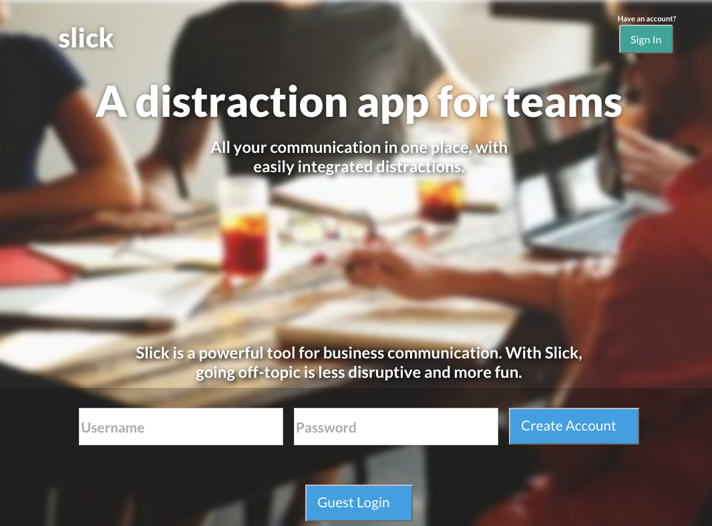
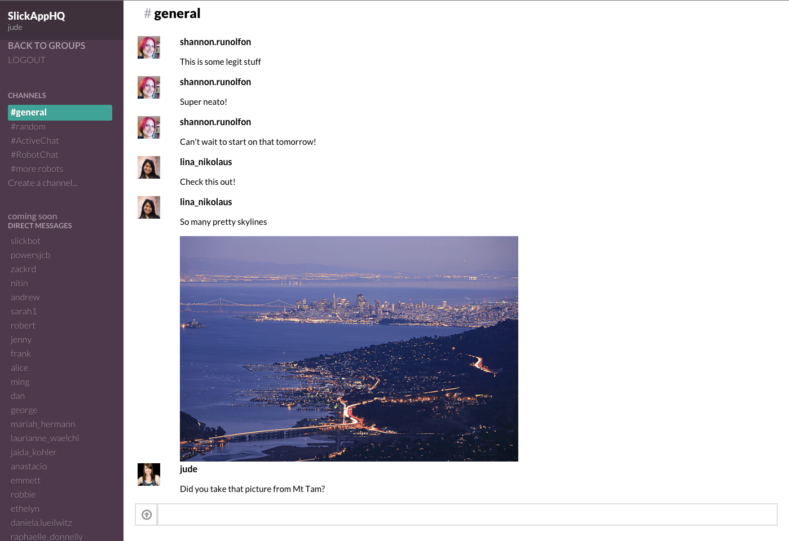

# Slack Clone
##[Slick - integrated office distractions](slickapp.io)





## Highlights
- [Backbone swapping router with matching utility for Pusher web-socket API](app/assets/javascripts/routers/router.js)

```javascript
// router.js
// pusher channel swapping utilities
_pusherSubscribeConv: function (conv_id) {
  if (this._convChannelName) {

    // closes connection to web-socket
    window.pusher.unsubscribe(this._convChannelName);
  }
    this._convChannelName = 'presence-conversation-' + conv_id;

    // opens new connection, event listeners are rebound to the pusher object
    return window.pusher.subscribe(this._convChannelName);
},
```

- [Smart page scrolling that allows for pagination, messages dynamically added from Pusher, new self posts, and initial page load. (continues to be the biggest challenge)](app/assets/javascripts/views/messages/messages_index.js)
```javascript
// messages_index.js
// debounced function for event listening that removes itself after initial page load
debouncedGTB: function a () {
  // each add event move to bottom of page
  this.$el.imagesLoaded( function () {
    this.goToBottom();
  }.bind(this));

  var timeout;
  var context = this;
  var wait = 50; // debounce timer

  var later = function() {
    timeout = null;
    func.call(context);
  };

  var callNow = !timeout;
  clearTimeout(timeout);
  timeout = setTimeout(later, wait);

  if (callNow) {
    func.apply(context);
  }

  // at the end stop listening
  function func () {
    this.stopListening(this.collection, 'add', a);
  }
},
```


## What would I do differently?
- Consider using a sub-router for the main views
- Scrolling with image loads is tricky, coerce images to a uniform size or use knowledge about them to make placeholder divs for page loads.
- Setup my own web-socket server using node.js or meteor.js
- Cross browser compatibility testing early and often


# Project planning
[MVP Schema](/docs/schema.md)

[Views](/docs/views.md)

[Wireframes](/docs/wireframes/)

## Minimum Viable Product
Slick the distraction tool for corporate organizations.

- Users log in
- Users can have near real time chat
- Group conversations
- Messages can be formatted with markdown for styling
- Messages with image urls are parsed to auto-embed in page
- Can join channels
- Create/join groups

## Timeline

### Phase 1: User auth, make group/private chat feeds (1 day)
Do auth. Implement the skeleton of a messaging app.  Messages will be done using plain rails views for testing purposes only.  The focus should be on building out as little as possible. (build everything presuming `Messages.all` will be the feed source)

### Phase 2: Inline edits with previews (2 days)
Get API rolling for backbone app, should be able to create and edit chat messages in a message index.(all posts from all users)  Setup naive ajax polling working to keep page updated.

### Phase 3: Groups and channels (2 days)
Build backbone interface for feeds of groups and channels.  Be able to switch between them.  Get the general HTML/CSS layout correct in this step. (Avoid framework dependent css, might not be able to get proper look easily with bootstrap.)

### Phase 4: Finish memberships, make it look good (1 days)
Finish anything remaining with groups and make the pages look kickass.  Barebones MVP should be done at this point.  If it looks okay at this point start adding bonus features.

### Phase 5: Add features (2 days)
Do pagination for the channel feeds.  Start testing websockets with pusher.
Weed out any remaining bugs/glitches. Add image uploads for profiles and messages.


### Phase 6: Add wish list items
- Show current users in channel
- Add private messages
- Favorite items (users, channels, posts)
- Search posts based on username and post content
- Can edit content in place
- Pin Items
- Create/view mentions
